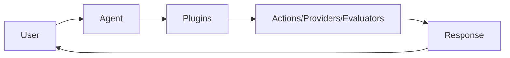

elizaOS has three main concepts:

<CardGroup cols={3}>
  <Card title="Agents" icon="robot" href="/core-concepts/agents">
    AI personalities that interact with users
  </Card>
  <Card title="Plugins" icon="puzzle" href="/core-concepts/plugins">
    Extensions that add capabilities
  </Card>
  <Card title="Projects" icon="folder-tree" href="/core-concepts/projects">
    Collections of agents and plugins
  </Card>
</CardGroup>

## How it Works



## Quick Example

An agent using plugins:

```json
{
  "name": "MyAgent",
  "plugins": [
    "@elizaos/plugin-discord",
    "@elizaos/plugin-twitter"
  ]
}
```

Plugins provide:
- **Actions** - Things agents can do (send messages, query data)
- **Providers** - Data sources (weather, time, knowledge)
- **Evaluators** - Response filters (safety, quality)
- **Services** - Background tasks (scheduled posts, monitoring)

## Next Steps

<Steps>
  <Step title="Learn about Agents">
    Create AI personalities with custom behaviors
  </Step>
  
  <Step title="Explore Plugins">
    Add capabilities like Discord, Twitter, or web search
  </Step>
  
  <Step title="Build Projects">
    Combine multiple agents for complex systems
  </Step>
</Steps>