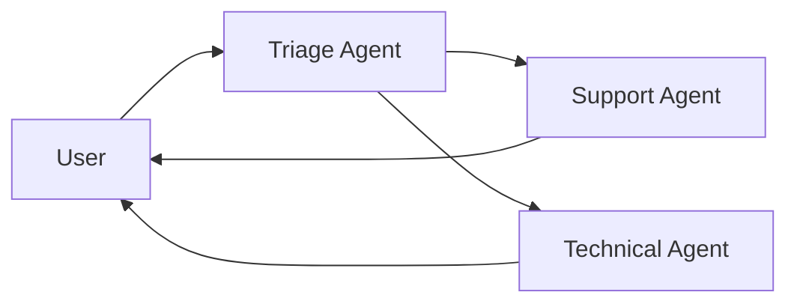

## What are Projects?

Projects combine one or more agents with plugins to create complete applications.

## Project Structure

```
my-project/
├── project.json          # Project config
├── agents/              # Agent definitions
│   ├── agent1.json
│   └── agent2.json
├── plugins/             # Custom plugins
├── .env                 # Environment variables
└── package.json         # Dependencies
```

## Project Configuration

```json project.json
{
  "name": "my-project",
  "version": "1.0.0",
  "description": "Multi-agent system",
  
  "agents": [
    {
      "id": "support",
      "file": "./agents/support.json",
      "instances": 2
    },
    {
      "id": "sales",
      "file": "./agents/sales.json",
      "instances": 1
    }
  ],
  
  "plugins": {
    "shared": [
      "@elizaos/plugin-database",
      "@elizaos/plugin-discord"
    ]
  }
}
```

## Single-Agent Projects

Most projects start with one agent:

```json
{
  "name": "simple-bot",
  "agents": [{
    "id": "bot",
    "file": "./agent.json"
  }]
}
```

## Multi-Agent Projects

For complex systems with specialized agents:

<CardGroup cols={2}>
  <Card title="Customer Service">
    - Triage agent routes inquiries
    - Support agent handles issues
    - Technical agent solves problems
  </Card>
  
  <Card title="Trading System">
    - Market analyst agent
    - Trading executor agent
    - Risk manager agent
  </Card>
</CardGroup>

## Agent Communication

Agents can work together:



## Environment Configuration

```bash .env
# API Keys
OPENAI_API_KEY=sk-...
DISCORD_BOT_TOKEN=...

# Database
DATABASE_URL=postgresql://localhost/mydb

# Project Settings
LOG_LEVEL=info
NODE_ENV=production
```

## Running Projects

```bash
# Development
elizaos start --project ./project.json

# Production
NODE_ENV=production elizaos start
```

## Example Projects

### Discord Support Bot

Single agent with Discord integration:

```json
{
  "name": "discord-support",
  "agents": [{
    "id": "support",
    "file": "./support-agent.json"
  }],
  "plugins": {
    "shared": ["@elizaos/plugin-discord"]
  }
}
```

### Trading Platform

Multiple specialized agents:

```json
{
  "name": "trading-platform",
  "agents": [
    {
      "id": "analyzer",
      "file": "./agents/analyzer.json"
    },
    {
      "id": "trader",
      "file": "./agents/trader.json"
    }
  ],
  "plugins": {
    "shared": [
      "@elizaos/plugin-binance",
      "@elizaos/plugin-dexscreener"
    ]
  }
}
```

## Best Practices

- Start with one agent, add more as needed
- Share common plugins across agents
- Use environment variables for secrets
- Keep agent responsibilities focused
- Test agents individually before combining

## Next Steps

<CardGroup cols={2}>
  <Card title="Deploy Your Project" icon="rocket" href="/deployment">
    Learn deployment options
  </Card>
  
  <Card title="Example Projects" icon="github" href="https://github.com/elizaOS/eliza/tree/main/examples">
    Browse sample projects
  </Card>
</CardGroup>