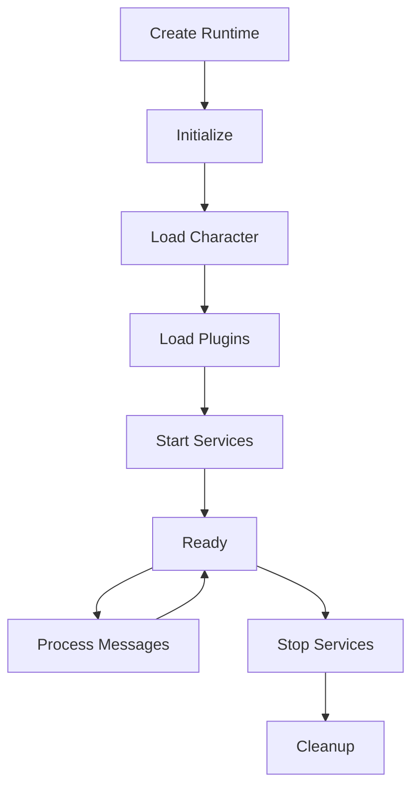

## What is AgentRuntime?

The AgentRuntime is the central orchestrator that manages agent lifecycle, processes messages, and coordinates all system components.

## Key Responsibilities

### 1. Message Processing

```typescript
async processMessage(message: Memory): Promise<Response> {
  // Compose state from providers
  const state = await this.composeState(message);
  
  // Select and execute action
  const action = await this.selectAction(state);
  const response = await action.handler(this, message, state);
  
  // Run evaluators
  await this.evaluate(message, response);
  
  return response;
}
```

### 2. State Composition

The runtime builds context by aggregating data from all providers:

```typescript
async composeState(message: Memory): Promise<State> {
  const state = {};
  
  for (const provider of this.providers) {
    const data = await provider.get(this, message, state);
    Object.assign(state, data);
  }
  
  return state;
}
```

### 3. Plugin Management

```typescript
async registerPlugin(plugin: Plugin) {
  // Register components
  plugin.actions?.forEach(a => this.registerAction(a));
  plugin.providers?.forEach(p => this.registerProvider(p));
  plugin.evaluators?.forEach(e => this.registerEvaluator(e));
  plugin.services?.forEach(s => this.registerService(s));
  
  // Initialize plugin
  await plugin.init?.(this.config, this);
}
```

## Runtime Interface

```typescript
interface IAgentRuntime {
  // Core properties
  agentId: UUID;
  character: Character;
  databaseAdapter: IDatabaseAdapter;
  
  // Message processing
  processMessage(message: Memory): Promise<void>;
  composeState(message: Memory): Promise<State>;
  
  // Component registration
  registerAction(action: Action): void;
  registerProvider(provider: Provider): void;
  registerEvaluator(evaluator: Evaluator): void;
  registerService(service: Service): void;
  
  // Service management
  getService<T>(name: string): T;
  startServices(): Promise<void>;
  stopServices(): Promise<void>;
  
  // Model management
  useModel(params: ModelParams): Promise<ModelResult>;
  registerModel(handler: ModelHandler): void;
  
  // Event system
  emitEvent(event: Event): void;
  registerEvent(handler: EventHandler): void;
}
```

## Lifecycle



## Model Management

The runtime manages AI model selection through a priority system:

```typescript
// Register model handlers
runtime.registerModel({
  model: ModelType.TEXT_GENERATION,
  priority: 100,
  handler: async (params) => {
    return await callOpenAI(params);
  }
});

// Use best available model
const result = await runtime.useModel({
  type: ModelType.TEXT_GENERATION,
  prompt: "Generate response"
});
```

## Memory Management

```typescript
// Store memories
await runtime.databaseAdapter.createMemory({
  type: MemoryType.MESSAGE,
  content: { text: "User message" },
  roomId: message.roomId
});

// Search memories
const memories = await runtime.databaseAdapter.searchMemories({
  query: "previous conversation",
  limit: 10
});
```

## Best Practices

- Initialize plugins in dependency order
- Start services after all plugins loaded
- Clean up resources on shutdown
- Handle errors gracefully
- Use appropriate model sizes

## Next Steps

<CardGroup cols={2}>
  <Card title="Memory System" icon="database" href="/deep-dive/memory-system">
    Understand memory management
  </Card>
  
  <Card title="Services" icon="server" href="/deep-dive/services">
    Learn about background services
  </Card>
</CardGroup>