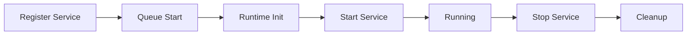

## What are Services?

Services are long-running background tasks that extend agent functionality beyond request-response patterns.

## Service Interface

```typescript
abstract class Service {
  abstract name: ServiceType;
  
  abstract start(runtime: IAgentRuntime): Promise<void>;
  abstract stop(): Promise<void>;
}
```

## Service Types

```typescript
enum ServiceType {
  BROWSER = 'browser',
  DATABASE_MIGRATION = 'database_migration',
  DISCORD = 'discord',
  DOCUMENT = 'document',
  IMAGE_GENERATION = 'image_generation',
  MEMORY_SEARCH = 'memory_search',
  MODEL = 'model',
  PDF = 'pdf',
  SEARCH = 'search',
  SPEECH = 'speech',
  TELEGRAM = 'telegram',
  TRANSCRIPTION = 'transcription',
  TWITTER = 'twitter',
  VIDEO = 'video',
  VOICE = 'voice',
  WALLET = 'wallet',
  WEBSOCKET = 'websocket'
}
```

## Common Service Patterns

### Platform Integration Service

```typescript
class DiscordService extends Service {
  name = ServiceType.DISCORD;
  private client: Discord.Client;
  
  async start(runtime: IAgentRuntime) {
    this.client = new Discord.Client();
    
    this.client.on('messageCreate', async (message) => {
      // Convert to Memory format
      const memory = await this.convertMessage(message);
      
      // Process through runtime
      await runtime.processMessage(memory);
    });
    
    await this.client.login(process.env.DISCORD_TOKEN);
  }
  
  async stop() {
    await this.client.destroy();
  }
}
```

### Background Task Service

```typescript
class TaskService extends Service {
  name = ServiceType.TASK;
  private interval: NodeJS.Timer;
  
  async start(runtime: IAgentRuntime) {
    // Check for scheduled tasks every minute
    this.interval = setInterval(async () => {
      const tasks = await runtime.databaseAdapter.getTasks({
        status: 'pending',
        scheduledFor: { $lte: new Date() }
      });
      
      for (const task of tasks) {
        await this.executeTask(task, runtime);
      }
    }, 60000);
  }
  
  async stop() {
    clearInterval(this.interval);
  }
}
```

### Model Service

```typescript
class OpenAIService extends Service {
  name = ServiceType.MODEL;
  private client: OpenAI;
  
  async start(runtime: IAgentRuntime) {
    this.client = new OpenAI({
      apiKey: process.env.OPENAI_API_KEY
    });
    
    // Register model handlers
    runtime.registerModel({
      type: ModelType.TEXT_GENERATION,
      handler: async (params) => {
        return await this.generate(params);
      }
    });
  }
  
  async generate(params: ModelParams) {
    const response = await this.client.chat.completions.create({
      model: "gpt-4",
      messages: params.messages
    });
    
    return response.choices[0].message;
  }
}
```

## Service Lifecycle



## Service Registration

```typescript
// In a plugin
export const discordPlugin: Plugin = {
  name: 'discord',
  services: [DiscordService],
  
  init: async (config, runtime) => {
    // Services auto-registered and started
  }
};
```

## Service Communication

Services can interact with the runtime and other services:

```typescript
class NotificationService extends Service {
  async notify(message: string) {
    // Get Discord service
    const discord = this.runtime.getService<DiscordService>('discord');
    await discord.sendMessage(channelId, message);
    
    // Get Twitter service
    const twitter = this.runtime.getService<TwitterService>('twitter');
    await twitter.tweet(message);
  }
}
```

## Best Practices

- Implement graceful shutdown in `stop()`
- Handle errors without crashing
- Use environment variables for config
- Avoid blocking operations
- Clean up resources properly

## Common Services

| Service | Purpose | Example Plugin |
|---------|---------|----------------|
| Platform Services | Connect to chat platforms | Discord, Telegram |
| Model Services | AI model providers | OpenAI, Anthropic |
| Data Services | External data sources | Web search, SQL |
| Media Services | Process media | TTS, image gen |
| Background Services | Scheduled tasks | Task runner |

## Next Steps

<CardGroup cols={2}>
  <Card title="Event System" icon="broadcast" href="/deep-dive/event-system">
    Learn about events
  </Card>
  
  <Card title="Model Providers" icon="brain" href="/deep-dive/model-providers">
    Explore AI models
  </Card>
</CardGroup>