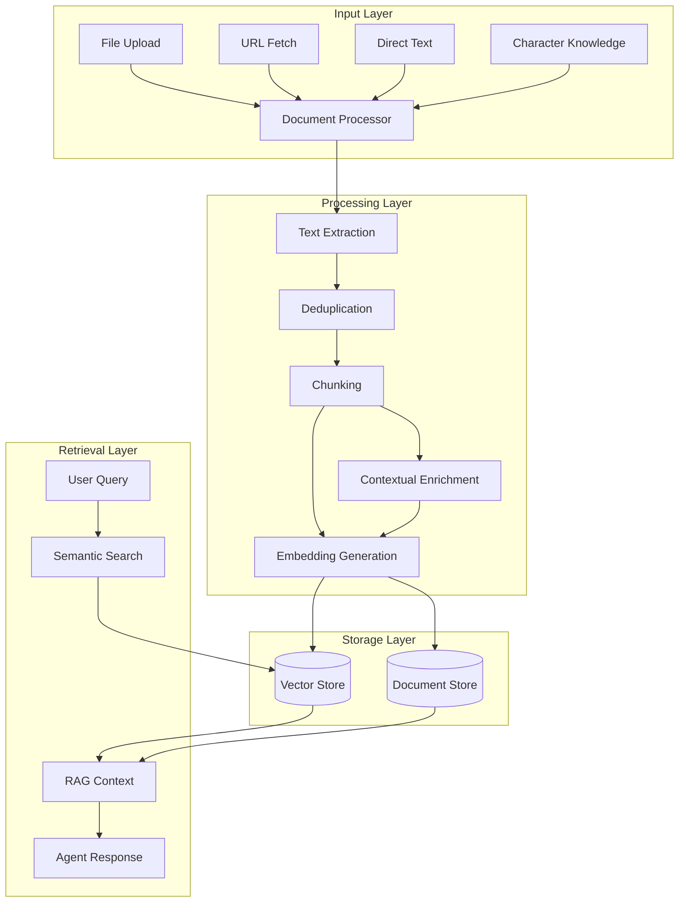

The `@elizaos/plugin-knowledge` package is the core Retrieval Augmented Generation (RAG) system for ElizaOS agents. It provides comprehensive document management, intelligent processing, and semantic retrieval capabilities.

## Key Capabilities

- **Document Processing**: Extract and process text from PDFs, Word docs, and more
- **Intelligent Chunking**: Content-aware splitting with configurable overlap
- **Vector Embeddings**: Generate and store embeddings using OpenAI or Google
- **Semantic Search**: Find relevant information using vector similarity
- **Automatic Context**: Inject relevant knowledge into agent conversations
- **Knowledge Management**: Built-in web interface for document control

## Architecture Overview



## Core Components

### Knowledge Service

The main service class that handles all knowledge operations:

```typescript
class KnowledgeService {
  constructor(
    private vectorStore: IMemoryManager,
    private documentsManager: IDatabaseAdapter,
    private embedder: IEmbeddingProvider
  ) {}

  async addKnowledge(options: AddKnowledgeOptions): Promise<void> {
    // Process and store knowledge
  }

  async searchKnowledge(query: string, limit: number = 10): Promise<KnowledgeItem[]> {
    // Semantic search implementation
  }

  async removeKnowledge(id: string): Promise<void> {
    // Remove knowledge and associated embeddings
  }
}
```

### Document Processor

Handles text extraction and chunking:

```typescript
class DocumentProcessor {
  async extractText(buffer: Buffer, mimeType: string): Promise<string> {
    switch (mimeType) {
      case 'application/pdf':
        return this.extractPDF(buffer);
      case 'application/vnd.openxmlformats-officedocument.wordprocessingml.document':
        return this.extractDOCX(buffer);
      default:
        return buffer.toString('utf-8');
    }
  }

  chunkText(text: string, options: ChunkOptions): string[] {
    // Intelligent chunking with overlap
  }
}
```

### Actions

The plugin provides two main actions:

```typescript
// PROCESS_KNOWLEDGE - Add new knowledge
{
  name: "PROCESS_KNOWLEDGE",
  handler: async (runtime, message, state) => {
    const knowledge = await extractKnowledge(message);
    await runtime.knowledgeService.addKnowledge(knowledge);
    return "Knowledge processed successfully";
  }
}

// SEARCH_KNOWLEDGE - Query knowledge base
{
  name: "SEARCH_KNOWLEDGE",
  handler: async (runtime, message, state) => {
    const query = message.text;
    const results = await runtime.knowledgeService.searchKnowledge(query);
    return formatResults(results);
  }
}
```

### Knowledge Provider

Automatically injects relevant knowledge into agent context:

```typescript
const knowledgeProvider: Provider = {
  get: async (runtime: IAgentRuntime, message: Memory) => {
    const relevantKnowledge = await runtime.knowledgeService.searchKnowledge(
      message.content.text,
      5
    );
    
    return relevantKnowledge.map(item => ({
      text: item.content,
      metadata: item.metadata
    }));
  }
};
```

## Document Processing Pipeline

### 1. Document Ingestion

Knowledge can be added through multiple channels:

```typescript
// File upload
await knowledgeService.addKnowledge({
  id: uuid(),
  content: fileContent,
  metadata: {
    source: 'upload',
    filename: 'document.pdf',
    mimeType: 'application/pdf'
  }
});

// URL processing
await knowledgeService.addKnowledge({
  id: uuid(),
  content: await fetchURL(url),
  metadata: {
    source: 'url',
    url: url
  }
});

// Direct text
await knowledgeService.addKnowledge({
  id: uuid(),
  content: "Important information...",
  metadata: {
    source: 'direct'
  }
});
```

### 2. Text Extraction

Supports multiple file formats:

```typescript
const supportedFormats = {
  'application/pdf': extractPDF,
  'application/vnd.openxmlformats-officedocument.wordprocessingml.document': extractDOCX,
  'text/plain': (buffer) => buffer.toString('utf-8'),
  'text/markdown': (buffer) => buffer.toString('utf-8'),
  'application/json': (buffer) => JSON.stringify(JSON.parse(buffer.toString('utf-8')), null, 2)
};
```

### 3. Content-Based Deduplication

Prevents duplicate content:

```typescript
function generateContentHash(content: string): string {
  return createHash('sha256')
    .update(normalizeContent(content))
    .digest('hex');
}

async function isDuplicate(hash: string): Promise<boolean> {
  const existing = await documentsManager.getByHash(hash);
  return existing !== null;
}
```

### 4. Intelligent Chunking

Content-aware text splitting:

```typescript
const defaultChunkOptions = {
  chunkSize: 500,      // tokens
  overlapSize: 100,    // tokens
  separators: ['\n\n', '\n', '. ', ' '],
  keepSeparator: true
};

function chunkText(text: string, options: ChunkOptions): string[] {
  const chunks: string[] = [];
  let currentChunk = '';
  
  // Smart chunking logic that respects:
  // - Token limits
  // - Sentence boundaries
  // - Paragraph structure
  // - Code blocks
  
  return chunks;
}
```

### 5. Contextual Enrichment

Optional feature for better retrieval:

```typescript
// When CTX_KNOWLEDGE_ENABLED=true
async function enrichChunk(chunk: string, document: string): Promise<string> {
  const context = await generateContext(chunk, document);
  return `${context}\n\n${chunk}`;
}
```

### 6. Embedding Generation

Create vector embeddings:

```typescript
async function generateEmbeddings(chunks: string[]): Promise<number[][]> {
  const embeddings = await embedder.embedMany(chunks);
  return embeddings;
}

// Batch processing with rate limiting
const batchSize = 10;
for (let i = 0; i < chunks.length; i += batchSize) {
  const batch = chunks.slice(i, i + batchSize);
  const embeddings = await generateEmbeddings(batch);
  await storeEmbeddings(embeddings);
  
  // Rate limiting
  await sleep(1000);
}
```

### 7. Storage

Documents and embeddings are stored separately:

```typescript
// Document storage
{
  id: "doc_123",
  content: "Full document text",
  metadata: {
    source: "upload",
    filename: "report.pdf",
    createdAt: "2024-01-20T10:00:00Z",
    hash: "sha256_hash"
  }
}

// Vector storage
{
  id: "vec_456",
  documentId: "doc_123",
  chunkIndex: 0,
  embedding: [0.123, -0.456, ...],
  content: "Chunk text",
  metadata: {
    position: { start: 0, end: 500 }
  }
}
```

## Retrieval & RAG

### Semantic Search

Find relevant knowledge using vector similarity:

```typescript
async function searchKnowledge(query: string, limit: number = 10): Promise<KnowledgeItem[]> {
  // Generate query embedding
  const queryEmbedding = await embedder.embed(query);
  
  // Search vector store
  const results = await vectorStore.searchMemories({
    tableName: "knowledge_embeddings",
    agentId: runtime.agentId,
    embedding: queryEmbedding,
    match_threshold: 0.7,
    match_count: limit,
    unique: true
  });
  
  // Enrich with document metadata
  return results.map(result => ({
    id: result.id,
    content: result.content.text,
    score: result.similarity,
    metadata: result.metadata
  }));
}
```

### RAG Context Building

Inject knowledge into agent prompts:

```typescript
function buildRAGContext(knowledge: KnowledgeItem[]): string {
  if (knowledge.length === 0) return '';
  
  return `Based on the following information:\n\n${
    knowledge.map((item, index) => 
      `[${index + 1}] ${item.content}\n(Source: ${item.metadata.source})`
    ).join('\n\n')
  }\n\n`;
}
```

### Conversation Memory with RAG

Track knowledge usage:

```typescript
// Store which knowledge was used
await runtime.messageManager.createMemory({
  agentId: runtime.agentId,
  userId: message.userId,
  roomId: message.roomId,
  content: {
    text: response,
    knowledgeUsed: knowledge.map(k => k.id)
  }
});
```

## API Reference

### REST Endpoints

#### Upload Documents

```http
POST /knowledge/upload
Content-Type: multipart/form-data

{
  "file": <binary>,
  "metadata": {
    "tags": ["product", "documentation"]
  }
}

Response: {
  "id": "doc_123",
  "status": "processing",
  "message": "Document uploaded successfully"
}
```

#### List Documents

```http
GET /knowledge/documents?page=1&limit=20

Response: {
  "documents": [
    {
      "id": "doc_123",
      "filename": "product-guide.pdf",
      "size": 1024000,
      "createdAt": "2024-01-20T10:00:00Z",
      "chunkCount": 15
    }
  ],
  "total": 45,
  "page": 1,
  "pages": 3
}
```

#### Delete Document

```http
DELETE /knowledge/documents/doc_123

Response: {
  "success": true,
  "message": "Document and associated embeddings deleted"
}
```

#### Search Knowledge

```http
GET /knowledge/search?q=pricing&limit=5

Response: {
  "results": [
    {
      "id": "chunk_456",
      "content": "Our pricing starts at $99/month...",
      "score": 0.92,
      "metadata": {
        "source": "pricing.pdf",
        "page": 3
      }
    }
  ]
}
```

### TypeScript Interfaces

```typescript
interface AddKnowledgeOptions {
  id: string;
  content: string | Buffer;
  metadata?: {
    source: 'upload' | 'url' | 'direct' | 'character';
    filename?: string;
    url?: string;
    mimeType?: string;
    tags?: string[];
    [key: string]: any;
  };
}

interface KnowledgeItem {
  id: string;
  content: string;
  metadata: Record<string, any>;
  similarity?: number;
}

interface ProcessingOptions {
  chunkSize?: number;
  overlapSize?: number;
  enableContextualEmbeddings?: boolean;
  maxChunksPerDoc?: number;
}

interface ModelConfig {
  provider: 'openai' | 'google' | 'openrouter';
  model: string;
  dimensions: number;
  maxTokens: number;
}
```

## Advanced Features

### Contextual Embeddings

Enable for 50% better retrieval accuracy:

```env
CTX_KNOWLEDGE_ENABLED=true
```

This feature:
- Adds document context to each chunk
- Improves semantic understanding
- Reduces false positives
- Enables better cross-reference retrieval

### Document Caching

With OpenRouter, enable caching for 90% cost reduction:

```typescript
const config = {
  provider: 'openrouter',
  enableCache: true,
  cacheExpiry: 86400 // 24 hours
};
```

### Custom Document Processors

Extend for special formats:

```typescript
class CustomProcessor extends DocumentProcessor {
  async extractCustomFormat(buffer: Buffer): Promise<string> {
    // Custom extraction logic
    return extractedText;
  }
  
  registerProcessor() {
    this.processors.set('application/custom', this.extractCustomFormat);
  }
}
```

### Performance Optimization

#### Rate Limiting

```typescript
const rateLimiter = {
  maxConcurrent: 5,
  requestsPerMinute: 60,
  tokensPerMinute: 40000
};
```

#### Batch Processing

```typescript
async function batchProcess(documents: Document[]) {
  const chunks = [];
  
  for (const batch of chunk(documents, 10)) {
    const results = await Promise.all(
      batch.map(doc => processDocument(doc))
    );
    chunks.push(...results);
    
    await sleep(1000); // Rate limiting
  }
  
  return chunks;
}
```

#### Memory Management

```typescript
// Clear cache periodically
setInterval(() => {
  knowledgeService.clearCache();
}, 3600000); // Every hour

// Stream large files
async function processLargeFile(path: string) {
  const stream = createReadStream(path);
  const chunks = [];
  
  for await (const chunk of stream) {
    chunks.push(await processChunk(chunk));
  }
  
  return chunks;
}
```

## Integration Patterns

### Basic Integration

```json
{
  "name": "SupportAgent",
  "plugins": ["@elizaos/plugin-knowledge"],
  "knowledge": [
    "Default knowledge statement 1",
    "Default knowledge statement 2"
  ]
}
```

### Custom Knowledge Sources

```typescript
// Add knowledge programmatically
async function importKnowledgeBase() {
  const documents = await fetchDocuments();
  
  for (const doc of documents) {
    await runtime.knowledgeService.addKnowledge({
      id: doc.id,
      content: doc.content,
      metadata: {
        source: 'import',
        category: doc.category
      }
    });
  }
}
```

### Knowledge-Aware Actions

```typescript
const researchAction: Action = {
  name: "RESEARCH_TOPIC",
  handler: async (runtime, message) => {
    const topic = extractTopic(message);
    
    // Search existing knowledge
    const knowledge = await runtime.knowledgeService.searchKnowledge(topic, 10);
    
    // Fetch additional info if needed
    if (knowledge.length < 5) {
      const webResults = await fetchWebResults(topic);
      await runtime.knowledgeService.addKnowledge({
        id: uuid(),
        content: webResults,
        metadata: { source: 'web', topic }
      });
    }
    
    return formatResearchResults(knowledge);
  }
};
```

## Best Practices

<Tabs>
  <Tab title="Document Organization">
    <Steps>
      <Step title="Use clear, descriptive filenames">
        Choose names that clearly indicate the content (e.g., `product-guide-v2.pdf` instead of `doc1.pdf`)
      </Step>
      <Step title="Group related documents in folders">
        Create logical folder structures like `products/`, `support/`, `policies/`
      </Step>
      <Step title="Tag documents with metadata">
        Add categories, dates, and versions to improve searchability
      </Step>
      <Step title="Keep individual documents focused">
        One topic per document for better retrieval accuracy
      </Step>
    </Steps>
  </Tab>
  
  <Tab title="Performance">
    <Steps>
      <Step title="Enable caching for frequently accessed knowledge">
        Set `enableCache: true` for 90% cost reduction on repeated queries
      </Step>
      <Step title="Use appropriate chunk sizes">
        Start with 500 tokens, adjust based on your content type
      </Step>
      <Step title="Implement rate limiting">
        Respect API limits with batch processing and delays
      </Step>
      <Step title="Monitor memory usage">
        Clear cache periodically for large knowledge bases
      </Step>
    </Steps>
  </Tab>
  
  <Tab title="Security">
    <Warning>
      <Steps>
        <Step title="Validate file uploads">
          Check file types, sizes, and scan for malicious content
        </Step>
        <Step title="Sanitize extracted text">
          Remove potentially harmful scripts or executable content
        </Step>
        <Step title="Implement access controls">
          Use role-based permissions for sensitive documents
        </Step>
        <Step title="Avoid storing sensitive data">
          Never embed passwords, API keys, or PII in the knowledge base
        </Step>
      </Steps>
    </Warning>
  </Tab>
  
  <Tab title="Testing">
    <Steps>
      <Step title="Test retrieval accuracy">
        Regularly verify that searches return relevant results
      </Step>
      <Step title="Validate chunk boundaries">
        Ensure important context isn't split across chunks
      </Step>
      <Step title="Ensure deduplication works">
        Test that duplicate uploads are properly detected
      </Step>
      <Step title="Monitor embedding quality">
        Check similarity scores and adjust thresholds as needed
      </Step>
    </Steps>
  </Tab>
</Tabs>

## Troubleshooting

### Common Issues

#### Documents Not Loading

<Warning>
Check file permissions and paths:
```bash
ls -la agent/docs/
# Should show read permissions
```
</Warning>

#### Poor Retrieval Quality

<Tip>
Try adjusting chunk size and overlap:
```env
EMBEDDING_CHUNK_SIZE=800
EMBEDDING_OVERLAP_SIZE=200
```
</Tip>

#### Rate Limiting Errors

<Note>
Implement exponential backoff:
```typescript
async function withRetry(fn, maxRetries = 3) {
  for (let i = 0; i < maxRetries; i++) {
    try {
      return await fn();
    } catch (error) {
      if (i === maxRetries - 1) throw error;
      await sleep(Math.pow(2, i) * 1000);
    }
  }
}
```
</Note>

### Debug Logging

Enable verbose logging:

```env
# .env
LOG_LEVEL=debug
KNOWLEDGE_DEBUG=true
```

```typescript
// View processing details
runtime.knowledgeService.on('processing', (event) => {
  console.log('Processing:', event);
});
```

## Summary

The Knowledge Plugin provides a comprehensive RAG system with:

<CardGroup cols={2}>
  <Card title="Document Processing" icon="file-lines">
    Complete pipeline for extracting and processing various file formats
  </Card>
  <Card title="Smart Chunking" icon="scissors">
    Intelligent content-aware splitting with deduplication
  </Card>
  <Card title="Vector Search" icon="magnifying-glass">
    High-performance semantic search capabilities
  </Card>
  <Card title="RAG Integration" icon="brain">
    Automatic knowledge injection into agent conversations
  </Card>
  <Card title="Web Interface" icon="window">
    Built-in management UI for document control
  </Card>
  <Card title="Production Ready" icon="rocket">
    Optimized for performance with caching and batch processing
  </Card>
</CardGroup>

This comprehensive system enables ElizaOS agents to maintain and query large knowledge bases efficiently, providing accurate, contextual responses based on uploaded documents and accumulated knowledge.