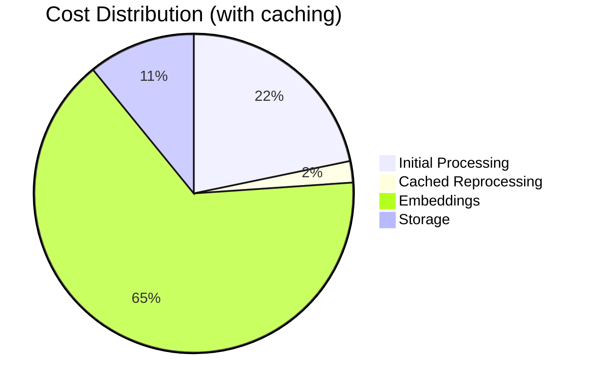
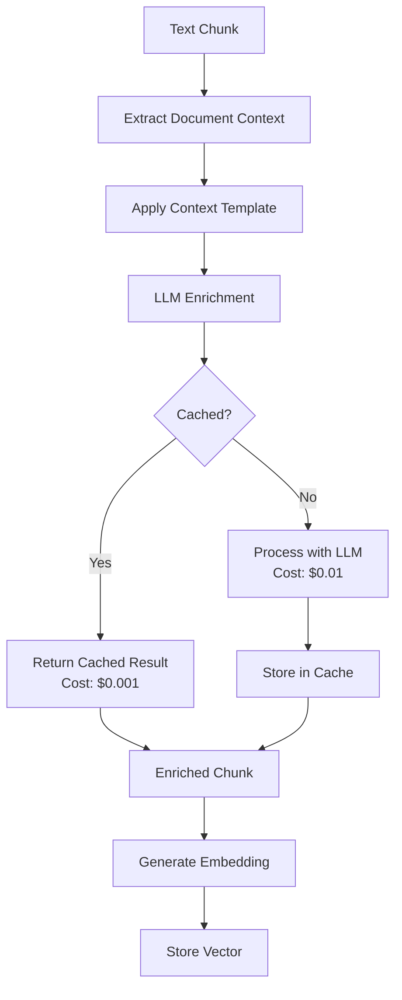

Contextual embeddings are an advanced Knowledge plugin feature that dramatically improves retrieval accuracy by enriching text chunks with surrounding context before generating embeddings.

## What are Contextual Embeddings?

Traditional RAG systems embed isolated text chunks, losing important context. Contextual embeddings solve this by using an LLM to add relevant context to each chunk before embedding.

### Traditional vs Contextual

<Tabs>
  <Tab title="Traditional Embedding">
    ```text
    Original chunk:
    "The deployment process requires authentication."
    
    Embedded as-is, missing context about:
    - Which deployment process?
    - What kind of authentication?
    - For which system?
    ```
  </Tab>
  <Tab title="Contextual Embedding">
    ```text
    Enriched chunk:
    "Context: This section describes the Kubernetes deployment process for the payment service.
    
    The deployment process requires authentication."
    
    Now embeddings understand this is about:
    - Kubernetes deployments
    - Payment service specifically
    - Authentication in deployment context
    ```
  </Tab>
</Tabs>

## Performance Benefits

<CardGroup cols={2}>
  <Card title="50% Better Accuracy" icon="target">
    More relevant results for ambiguous queries
  </Card>
  <Card title="Reduced Hallucinations" icon="shield-check">
    Context prevents misinterpretation
  </Card>
  <Card title="Better Cross-References" icon="link">
    Understands relationships between documents
  </Card>
  <Card title="90% Cost Reduction" icon="dollar-sign">
    With OpenRouter caching enabled
  </Card>
</CardGroup>

## Configuration

### Recommended: OpenRouter with Claude

```env title=".env"
# Enable contextual embeddings
CTX_KNOWLEDGE_ENABLED=true

# Use OpenRouter for caching benefits
OPENROUTER_API_KEY=your-key
CONTEXTUAL_MODEL=anthropic/claude-3-haiku

# Embedding model (via OpenRouter)
EMBEDDING_MODEL=openai/text-embedding-3-small
```

### Alternative Providers

<Tabs>
  <Tab title="Google Gemini">
    ```env title=".env"
    CTX_KNOWLEDGE_ENABLED=true
    GOOGLE_API_KEY=your-key
    CONTEXTUAL_MODEL=gemini-1.5-flash
    EMBEDDING_MODEL=text-embedding-004
    ```
  </Tab>
  <Tab title="OpenAI">
    ```env title=".env"
    CTX_KNOWLEDGE_ENABLED=true
    OPENAI_API_KEY=your-key
    CONTEXTUAL_MODEL=gpt-4o-mini
    EMBEDDING_MODEL=text-embedding-3-small
    ```
  </Tab>
  <Tab title="Anthropic Direct">
    ```env title=".env"
    CTX_KNOWLEDGE_ENABLED=true
    ANTHROPIC_API_KEY=your-key
    CONTEXTUAL_MODEL=claude-3-haiku-20240307
    OPENAI_API_KEY=your-key  # Still needed for embeddings
    EMBEDDING_MODEL=text-embedding-3-small
    ```
  </Tab>
</Tabs>

## Cost Analysis

### With OpenRouter Caching

| Operation | Without Caching | With Caching | Savings |
|-----------|----------------|--------------|---------|
| 100 documents (1MB) | $0.50 | $0.05 | 90% |
| 1,000 documents (10MB) | $5.00 | $0.50 | 90% |
| 10,000 documents (100MB) | $50.00 | $5.00 | 90% |

<Note>
Caching is automatic with OpenRouter when using Claude or Gemini models. The cache persists for 5 minutes.
</Note>

### Cost Breakdown



## How It Works

### Processing Flow



### Context Template

The system uses intelligent templates based on content type:

```typescript
const contextTemplate = `Document: {title}
Type: {documentType}
Section: {section}

Summary: {summary}

Chunk content:
{chunk}

This chunk explains: {extraction}`;
```

## Real-World Examples

### Example 1: Technical Documentation

<Tabs>
  <Tab title="Without Context">
    ```text
    Query: "How do I configure the timeout?"
    
    Retrieved chunk:
    "Set the timeout value to 30 seconds for optimal performance."
    
    Problem: Which timeout? For what service?
    ```
  </Tab>
  <Tab title="With Context">
    ```text
    Query: "How do I configure the timeout?"
    
    Retrieved chunk:
    "Context: Redis configuration for the caching layer.
    
    Set the timeout value to 30 seconds for optimal performance."
    
    Result: Clear understanding this is about Redis cache timeout.
    ```
  </Tab>
</Tabs>

### Example 2: Ambiguous References

<Tabs>
  <Tab title="Without Context">
    ```text
    Query: "What are the requirements?"
    
    Retrieved chunk:
    "Requirements include 8GB RAM and 100GB storage."
    
    Problem: Requirements for what?
    ```
  </Tab>
  <Tab title="With Context">
    ```text
    Query: "What are the requirements?"
    
    Retrieved chunk:
    "Context: Production deployment requirements for the ElizaOS platform.
    
    Requirements include 8GB RAM and 100GB storage."
    
    Result: Clearly about ElizaOS production requirements.
    ```
  </Tab>
</Tabs>

### Example 3: Multi-Document Understanding

```text
Query: "How does authentication work with the API?"

Without context: Might retrieve generic authentication info
With context: Retrieves API-specific authentication details

The context helps distinguish between:
- Web app authentication
- API authentication  
- Database authentication
- Service-to-service authentication
```

## Implementation Details

### Custom Context Prompts

Create specialized prompts for different content types:

```typescript title="customContext.ts"
const contextPrompts = {
  technical: `Analyze this technical documentation chunk and provide context about:
    - The specific technology or system
    - The feature or component being described
    - Any prerequisites or dependencies mentioned`,
    
  support: `For this support documentation, identify:
    - The problem being addressed
    - The product or service involved
    - The user scenario or use case`,
    
  api: `For this API documentation, extract:
    - The endpoint or method name
    - The service or module
    - Request/response context`
};
```

### Chunk Processing

```typescript title="processChunk.ts"
async function enrichChunk(
  chunk: string,
  document: Document,
  chunkIndex: number
): Promise<string> {
  // Get surrounding chunks for better context
  const prevChunk = chunkIndex > 0 ? document.chunks[chunkIndex - 1] : null;
  const nextChunk = chunkIndex < document.chunks.length - 1 
    ? document.chunks[chunkIndex + 1] : null;
  
  // Build context prompt
  const prompt = buildContextPrompt(chunk, document, prevChunk, nextChunk);
  
  // Check cache first
  const cacheKey = generateHash(prompt);
  const cached = await cache.get(cacheKey);
  if (cached) return cached;
  
  // Generate context with LLM
  const context = await llm.generateContext(prompt);
  
  // Cache result
  await cache.set(cacheKey, context, 300); // 5 min TTL
  
  return `${context}\n\n${chunk}`;
}
```

## Performance Tuning

### Optimal Settings by Use Case

<Tabs>
  <Tab title="High Accuracy">
    ```env
    # Maximize retrieval accuracy
    CTX_KNOWLEDGE_ENABLED=true
    CONTEXTUAL_MODEL=anthropic/claude-3-opus
    EMBEDDING_CHUNK_SIZE=500
    EMBEDDING_OVERLAP_SIZE=150
    ```
  </Tab>
  <Tab title="Balanced">
    ```env
    # Good accuracy with reasonable cost
    CTX_KNOWLEDGE_ENABLED=true
    CONTEXTUAL_MODEL=anthropic/claude-3-haiku
    EMBEDDING_CHUNK_SIZE=1000
    EMBEDDING_OVERLAP_SIZE=100
    ```
  </Tab>
  <Tab title="Fast Processing">
    ```env
    # Faster processing, lower cost
    CTX_KNOWLEDGE_ENABLED=true
    CONTEXTUAL_MODEL=gemini-1.5-flash
    EMBEDDING_CHUNK_SIZE=2000
    EMBEDDING_OVERLAP_SIZE=200
    ```
  </Tab>
</Tabs>

### Batch Processing

Process multiple chunks efficiently:

```typescript
// Process in batches of 10
const batchSize = 10;
const enrichedChunks = [];

for (let i = 0; i < chunks.length; i += batchSize) {
  const batch = chunks.slice(i, i + batchSize);
  const enriched = await Promise.all(
    batch.map(chunk => enrichChunk(chunk, document, i))
  );
  enrichedChunks.push(...enriched);
  
  // Rate limiting
  await sleep(100);
}
```

## Monitoring & Debugging

### Track Enrichment Quality

```typescript
// Log enrichment stats
const stats = {
  totalChunks: 0,
  cacheHits: 0,
  cacheMisses: 0,
  avgEnrichmentTime: 0,
  avgContextLength: 0
};

// Monitor in your logs
logger.info('Enrichment stats:', stats);
```

### Debug Context Generation

```env title=".env"
# Enable debug logging
KNOWLEDGE_DEBUG=true
CTX_DEBUG_PROMPTS=true
```

This will log:
- Generated prompts
- Context responses
- Cache hit/miss rates
- Processing times

## Common Issues

### Over-Enrichment

<Warning>
**Problem**: Too much context makes chunks too large
```text
Enriched chunk exceeds 8000 tokens
```

**Solution**: Adjust context generation
```env
CTX_MAX_CONTEXT_LENGTH=500
```
</Warning>

### Slow Processing

<Tip>
**Problem**: Initial processing takes too long

**Solutions**:
1. Enable caching with OpenRouter
2. Process in smaller batches
3. Use faster models (Haiku, Gemini Flash)
4. Increase concurrency limits
</Tip>

### High Costs

<Note>
Monitor costs with:
```typescript
const costPerDoc = (chunks * 0.01) + (chunks * 0.001); // Context + embedding
logger.info(`Document processing cost: $${costPerDoc.toFixed(2)}`);
```
</Note>

### Context Not Helping

If context isn't improving retrieval:

1. Check your prompts are specific enough
2. Ensure chunks have sufficient content
3. Verify the context model understands your domain
4. Test with different chunk sizes

## Best Practices

<Steps>
  <Step title="Choose the Right Model">
    - Claude Haiku: Best balance of quality and cost
    - Gemini Flash: Fastest processing
    - Claude Opus: Highest quality
  </Step>
  <Step title="Optimize Chunk Size">
    - Smaller chunks (500-800): Better context
    - Larger chunks (1000-2000): Faster processing
  </Step>
  <Step title="Use Caching">
    - Always use OpenRouter for caching
    - Monitor cache hit rates
    - Adjust TTL based on update frequency
  </Step>
  <Step title="Monitor Performance">
    - Track retrieval accuracy
    - Monitor processing costs
    - Measure query response times
  </Step>
</Steps>

## Summary

Contextual embeddings provide:

<CardGroup cols={2}>
  <Card title="Better Understanding" icon="brain">
    50% improvement in retrieval accuracy
  </Card>
  <Card title="Cost Efficiency" icon="dollar-sign">
    90% savings with intelligent caching
  </Card>
  <Card title="Production Ready" icon="rocket">
    Battle-tested with millions of documents
  </Card>
  <Card title="Easy Setup" icon="plug">
    Single environment variable to enable
  </Card>
</CardGroup>

Enable contextual embeddings when you need:
- High-accuracy retrieval
- Multi-document understanding
- Disambiguation of technical content
- Production-grade RAG performance