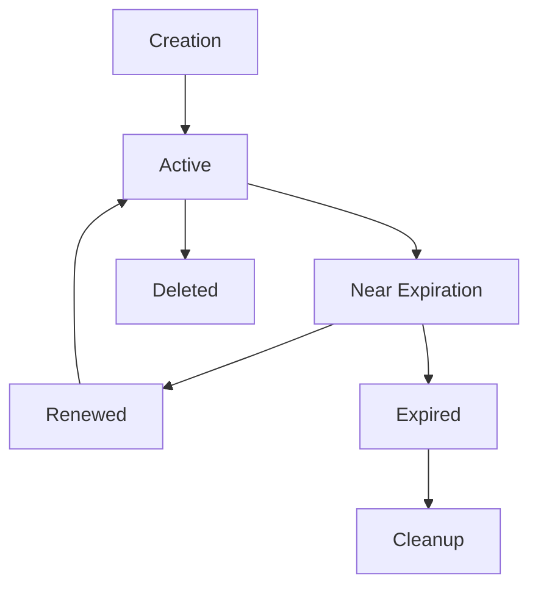

## Sessions Architecture

The Sessions API provides a sophisticated abstraction layer over the traditional messaging infrastructure, enabling persistent, stateful conversations with automatic timeout management and renewal capabilities.

## Core Design Principles

### Abstraction Over Complexity

The Sessions API abstracts away channel and server management complexity:

```typescript
// Traditional approach (complex)
const server = await createServer({ name: 'My Server' });
const channel = await createChannel({ serverId: server.id });
await addAgentToServer(server.id, agentId);
await addAgentToChannel(channel.id, agentId);
await sendMessage(channel.id, { content: 'Hello' });

// Sessions approach (simple)
const { sessionId } = await createSession({ agentId, userId });
await sendSessionMessage(sessionId, { content: 'Hello' });
```

### State Management

Sessions maintain state across multiple dimensions:

```typescript
interface Session {
  // Identity
  id: string;
  agentId: UUID;
  userId: UUID;
  channelId: UUID;
  
  // Temporal State
  createdAt: Date;
  lastActivity: Date;
  expiresAt: Date;
  
  // Configuration
  timeoutConfig: SessionTimeoutConfig;
  
  // Lifecycle State
  renewalCount: number;
  warningState?: {
    sent: boolean;
    sentAt: Date;
  };
  
  // Application State
  metadata: Record<string, any>;
}
```

## Session Lifecycle



### Lifecycle Phases

1. **Creation**: Initialize session with configuration
2. **Active**: Process messages and maintain state
3. **Near Expiration**: Warning state before timeout
4. **Renewed**: Lifetime extended (auto or manual)
5. **Expired**: Session exceeded timeout
6. **Deleted**: Explicit termination
7. **Cleanup**: Resource cleanup

## Timeout Configuration

### Configuration Interface

```typescript
interface SessionTimeoutConfig {
  timeoutMinutes?: number;           // Inactivity timeout (5-1440)
  autoRenew?: boolean;               // Auto-renew on activity
  maxDurationMinutes?: number;       // Maximum total duration
  warningThresholdMinutes?: number;  // Warning threshold
}
```

### Configuration Hierarchy

Configuration follows a three-tier precedence:

```typescript
// Priority Order (highest to lowest)
// 1. Session-specific config
// 2. Agent-specific config
// 3. Global defaults

const finalConfig = {
  ...globalDefaults,
  ...agentConfig,
  ...sessionConfig
};
```

### Environment Variables

Global default configuration:

- `SESSION_DEFAULT_TIMEOUT_MINUTES` (default: 30)
- `SESSION_MIN_TIMEOUT_MINUTES` (default: 5)
- `SESSION_MAX_TIMEOUT_MINUTES` (default: 1440)
- `SESSION_MAX_DURATION_MINUTES` (default: 720)
- `SESSION_WARNING_THRESHOLD_MINUTES` (default: 5)

## Session Creation

### Creation Process

```typescript
async function createSession(request: CreateSessionRequest) {
  // Phase 1: Validation
  validateUUIDs(request.agentId, request.userId);
  validateMetadata(request.metadata);
  
  // Phase 2: Agent verification
  const agent = agents.get(request.agentId);
  if (!agent) throw new AgentNotFoundError();
  
  // Phase 3: Configuration resolution
  const agentConfig = getAgentTimeoutConfig(agent);
  const finalConfig = mergeTimeoutConfigs(
    request.timeoutConfig,
    agentConfig
  );
  
  // Phase 4: Infrastructure setup
  const sessionId = uuidv4();
  const channelId = uuidv4();
  
  // Atomic channel creation
  await serverInstance.createChannel({
    id: channelId,
    name: `session-${sessionId}`,
    type: ChannelType.DM,
    metadata: {
      sessionId,
      agentId: request.agentId,
      userId: request.userId,
      timeoutConfig: finalConfig,
      ...request.metadata
    }
  });
  
  // Phase 5: Session registration
  const session = new Session(sessionId, channelId, finalConfig);
  sessions.set(sessionId, session);
  
  return session;
}
```

## Active Session Management

### Message Handling

```typescript
async function handleMessage(sessionId: string, message: SendMessageRequest) {
  const session = sessions.get(sessionId);
  
  // Expiration check
  if (session.isExpired()) {
    sessions.delete(sessionId);
    throw new SessionExpiredError();
  }
  
  // Activity tracking
  session.updateLastActivity();
  
  // Renewal logic
  if (session.timeoutConfig.autoRenew) {
    const renewed = session.attemptRenewal();
    if (renewed) {
      logger.info(`Session ${sessionId} auto-renewed`);
    }
  }
  
  // Warning detection
  if (session.isNearExpiration()) {
    session.markWarningState();
  }
  
  // Message creation
  const dbMessage = await serverInstance.createMessage({
    channelId: session.channelId,
    authorId: session.userId,
    content: message.content,
    metadata: {
      sessionId,
      ...message.metadata
    }
  });
  
  // Response enrichment
  return {
    ...dbMessage,
    sessionStatus: session.getStatus()
  };
}
```

## Renewal Mechanism

### Renewal Engine

```typescript
class SessionRenewalEngine {
  attemptRenewal(session: Session): boolean {
    // Check if renewal is allowed
    if (!session.timeoutConfig.autoRenew) {
      return false;
    }
    
    // Check maximum duration constraint
    const totalDuration = Date.now() - session.createdAt.getTime();
    const maxDurationMs = session.timeoutConfig.maxDurationMinutes * 60 * 1000;
    
    if (totalDuration >= maxDurationMs) {
      logger.warn(`Session ${session.id} reached max duration`);
      return false;
    }
    
    // Calculate new expiration
    const timeoutMs = session.timeoutConfig.timeoutMinutes * 60 * 1000;
    const remainingMaxDuration = maxDurationMs - totalDuration;
    const effectiveTimeout = Math.min(timeoutMs, remainingMaxDuration);
    
    // Update session
    session.lastActivity = new Date();
    session.expiresAt = new Date(Date.now() + effectiveTimeout);
    session.renewalCount++;
    session.warningState = undefined; // Reset warning
    
    return true;
  }
}
```

### Manual Renewal

```typescript
async function renewSession(sessionId: string): Promise<SessionStatus> {
  const session = sessions.get(sessionId);
  
  if (!session) {
    throw new SessionNotFoundError(sessionId);
  }
  
  if (session.isExpired()) {
    throw new SessionExpiredError(sessionId, session.expiresAt);
  }
  
  const renewed = session.attemptRenewal();
  
  if (!renewed) {
    throw new SessionRenewalError(
      sessionId,
      'Maximum duration reached',
      { maxDuration: session.timeoutConfig.maxDurationMinutes }
    );
  }
  
  return session.getStatus();
}
```

## Session Store

### In-Memory Storage

```typescript
class SessionStore {
  private sessions = new Map<string, Session>();
  private metrics = {
    totalCreated: 0,
    totalExpired: 0,
    totalDeleted: 0,
    peakConcurrent: 0
  };
  
  set(sessionId: string, session: Session) {
    this.sessions.set(sessionId, session);
    this.metrics.totalCreated++;
    this.updatePeakConcurrent();
  }
  
  get(sessionId: string): Session | undefined {
    const session = this.sessions.get(sessionId);
    
    // Lazy expiration check
    if (session && session.isExpired()) {
      this.delete(sessionId);
      this.metrics.totalExpired++;
      return undefined;
    }
    
    return session;
  }
  
  delete(sessionId: string): boolean {
    const deleted = this.sessions.delete(sessionId);
    if (deleted) {
      this.metrics.totalDeleted++;
    }
    return deleted;
  }
  
  private updatePeakConcurrent() {
    const current = this.sessions.size;
    if (current > this.metrics.peakConcurrent) {
      this.metrics.peakConcurrent = current;
    }
  }
}
```

## Cleanup Service

### Automatic Cleanup

```typescript
class SessionCleanupService {
  private cleanupInterval: NodeJS.Timeout;
  
  start(intervalMs: number = 5 * 60 * 1000) {
    this.cleanupInterval = setInterval(() => {
      this.performCleanup();
    }, intervalMs);
  }
  
  performCleanup() {
    const now = Date.now();
    const stats = {
      cleaned: 0,
      expired: 0,
      warned: 0,
      invalid: 0
    };
    
    for (const [sessionId, session] of sessions.entries()) {
      // Validate session structure
      if (!this.isValidSession(session)) {
        sessions.delete(sessionId);
        stats.invalid++;
        continue;
      }
      
      // Remove expired sessions
      if (session.expiresAt.getTime() <= now) {
        sessions.delete(sessionId);
        stats.expired++;
        stats.cleaned++;
        
        // Optional: Clean up associated resources
        this.cleanupChannelResources(session.channelId);
      }
      // Issue expiration warnings
      else if (this.shouldWarn(session)) {
        session.markWarningState();
        stats.warned++;
        
        // Optional: Emit warning event
        this.emitExpirationWarning(session);
      }
    }
    
    if (stats.cleaned > 0 || stats.warned > 0) {
      logger.info('Cleanup cycle completed:', stats);
    }
  }
  
  stop() {
    if (this.cleanupInterval) {
      clearInterval(this.cleanupInterval);
    }
  }
}
```

## Memory Management

### Memory Leak Prevention

```typescript
class BoundedCache extends Map {
  private maxSize: number;
  
  constructor(maxSize: number = 1000) {
    super();
    this.maxSize = maxSize;
  }
  
  set(key: string, value: any) {
    // Remove oldest entries if at capacity
    if (this.size >= this.maxSize) {
      const firstKey = this.keys().next().value;
      this.delete(firstKey);
    }
    return super.set(key, value);
  }
}

// Process lifecycle hooks
process.once('SIGTERM', clearAllIntervals);
process.once('SIGINT', clearAllIntervals);
process.once('beforeExit', clearAllIntervals);
```

### Cache with TTL

```typescript
class CacheWithTTL extends Map {
  private ttl: number;
  private timestamps = new Map<string, number>();
  
  constructor(ttl: number = 5 * 60 * 1000) {
    super();
    this.ttl = ttl;
  }
  
  set(key: string, value: any) {
    this.timestamps.set(key, Date.now());
    return super.set(key, value);
  }
  
  get(key: string) {
    const timestamp = this.timestamps.get(key);
    if (timestamp && Date.now() - timestamp > this.ttl) {
      this.delete(key);
      return undefined;
    }
    return super.get(key);
  }
}
```

## Error Handling

### Custom Error Classes

```typescript
abstract class SessionError extends Error {
  constructor(
    message: string,
    public code: string,
    public statusCode: number,
    public details?: any
  ) {
    super(message);
    this.name = this.constructor.name;
  }
}

class SessionNotFoundError extends SessionError {
  constructor(sessionId: string) {
    super(
      `Session not found: ${sessionId}`,
      'SESSION_NOT_FOUND',
      404,
      { sessionId }
    );
  }
}

class SessionExpiredError extends SessionError {
  constructor(sessionId: string, expiresAt: Date) {
    super(
      `Session has expired`,
      'SESSION_EXPIRED',
      410, // Gone
      { sessionId, expiresAt }
    );
  }
}

class SessionRenewalError extends SessionError {
  constructor(sessionId: string, reason: string, details?: any) {
    super(
      `Cannot renew session: ${reason}`,
      'SESSION_RENEWAL_FAILED',
      422, // Unprocessable Entity
      { sessionId, reason, ...details }
    );
  }
}
```

### Error Handler Middleware

```typescript
function createErrorHandler() {
  return (
    err: any,
    req: express.Request,
    res: express.Response,
    next: express.NextFunction
  ) => {
    if (err instanceof SessionError) {
      logger.error(`[Sessions API] ${err.code}:`, err.message, err.details);
      
      return res.status(err.statusCode).json({
        error: err.message,
        code: err.code,
        details: process.env.NODE_ENV === 'development' ? err.details : undefined
      });
    }
    
    // Handle unexpected errors
    logger.error('[Sessions API] Unexpected error:', err);
    
    res.status(500).json({
      error: 'Internal server error',
      code: 'INTERNAL_ERROR'
    });
  };
}
```

## Performance Optimization

### Pagination Strategy

```typescript
async function getMessagesOptimized(
  sessionId: string,
  query: GetMessagesQuery
) {
  const session = sessions.get(sessionId);
  
  // Smart fetching strategy
  if (query.after && !query.before) {
    // Forward pagination - fetch extra for filtering
    const messages = await fetchMessages(
      session.channelId,
      query.limit * 2
    );
    
    return messages
      .filter(m => m.createdAt > query.after)
      .slice(0, query.limit);
  }
  
  if (query.before && !query.after) {
    // Backward pagination - direct fetch
    return await fetchMessages(
      session.channelId,
      query.limit,
      query.before
    );
  }
  
  // Default - latest messages
  return await fetchMessages(session.channelId, query.limit);
}
```

### Configuration Caching

```typescript
class AgentConfigCache {
  private cache = new Map<UUID, SessionTimeoutConfig>();
  private maxAge = 5 * 60 * 1000; // 5 minutes
  private timestamps = new Map<UUID, number>();
  
  get(agentId: UUID): SessionTimeoutConfig | undefined {
    const timestamp = this.timestamps.get(agentId);
    
    if (timestamp && Date.now() - timestamp > this.maxAge) {
      // Cache expired
      this.cache.delete(agentId);
      this.timestamps.delete(agentId);
      return undefined;
    }
    
    return this.cache.get(agentId);
  }
  
  set(agentId: UUID, config: SessionTimeoutConfig) {
    this.cache.set(agentId, config);
    this.timestamps.set(agentId, Date.now());
  }
}
```

## Scalability Considerations

### Horizontal Scaling

For production deployments:

1. **Session Store Distribution**
   - Use Redis for distributed session storage
   - Implement session affinity for WebSocket connections
   - Use consistent hashing for session distribution

2. **Message Queue Integration**
   - Decouple message processing from API responses
   - Use message queues for agent processing
   - Implement async response patterns

3. **Database Optimization**
   - Index session-related columns
   - Implement connection pooling
   - Consider read replicas for message retrieval

### Monitoring Metrics

```typescript
interface SessionMetrics {
  // Volume metrics
  sessionsCreated: Counter;
  sessionsExpired: Counter;
  sessionsRenewed: Counter;
  
  // Performance metrics
  messageLatency: Histogram;
  renewalLatency: Histogram;
  
  // Health metrics
  activeSessions: Gauge;
  sessionsByAgent: Gauge;
  expirationWarnings: Counter;
  
  // Error metrics
  validationErrors: Counter;
  expirationErrors: Counter;
  renewalFailures: Counter;
}
```

## Security Considerations

### Input Validation

```typescript
// UUID validation
function validateUuid(value: string): boolean {
  const uuidRegex = /^[0-9a-f]{8}-[0-9a-f]{4}-4[0-9a-f]{3}-[89ab][0-9a-f]{3}-[0-9a-f]{12}$/i;
  return uuidRegex.test(value);
}

// Content validation
function validateContent(content: unknown): void {
  if (typeof content !== 'string') {
    throw new InvalidContentError('Content must be a string');
  }
  
  if (content.length === 0) {
    throw new InvalidContentError('Content cannot be empty');
  }
  
  if (content.length > MAX_CONTENT_LENGTH) {
    throw new InvalidContentError(
      `Content exceeds maximum length of ${MAX_CONTENT_LENGTH}`
    );
  }
}

// Metadata validation
function validateMetadata(metadata: unknown): void {
  if (!metadata) return;
  
  const size = JSON.stringify(metadata).length;
  if (size > MAX_METADATA_SIZE) {
    throw new InvalidMetadataError(
      `Metadata exceeds maximum size of ${MAX_METADATA_SIZE} bytes`
    );
  }
}
```

### Rate Limiting

```typescript
interface RateLimitConfig {
  windowMs: number;
  maxRequests: number;
  keyGenerator: (req: Request) => string;
}

const sessionRateLimits = {
  create: {
    windowMs: 60 * 1000,
    maxRequests: 10,
    keyGenerator: (req) => req.ip
  },
  message: {
    windowMs: 60 * 1000,
    maxRequests: 100,
    keyGenerator: (req) => `${req.params.sessionId}:${req.ip}`
  }
};
```

## Best Practices

### Session Design

- **Appropriate Timeouts**: Choose timeouts based on use case
- **Auto-Renewal**: Enable for active conversations
- **Max Duration**: Set limits to prevent infinite sessions
- **Warning Handling**: Notify users before expiration
- **Cleanup Strategy**: Regular cleanup of expired sessions

### Implementation

- **Error Recovery**: Graceful handling of session loss
- **State Persistence**: Consider persistent storage for production
- **Monitoring**: Track session metrics and health
- **Testing**: Test timeout and renewal scenarios
- **Documentation**: Document session behavior clearly
